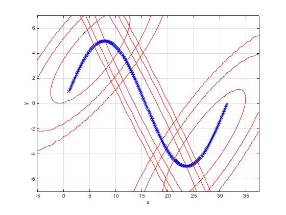

# EM_GMM
Matlab code to fit a Gaussian Mixture Model (GMM) using the EM algorithm
<h2> How to use the code </h2>
Fit a GMM using:   
      
    P = trainGMM(data,numComponents,maxIter,needDiag,printLikelihood)

Params:

      data - a NxP matrix where the rows are points and the columns are
              variables. e.g. N 2-D points would have N rows and 2
               columns

      numComponents - the number of gaussian mixture components

      maxIter - the number of iterations to run expectation-maximization
               (EM) for fitting the GMMs

      needDiag - set as 1 if you want diagonal covariance matrices for
               the components. Set as 0 otherwise.

      printLikelihood - set as 1 to print the log likelihood at each EM
                   iteration

Returns: 

      P - a struct that holds the parameters of the GMM. P.comp is a
           list of structs that holds the parameters for each component.
           For component i, P.comp(i) contains that component's mixing
           weight "alpha", and the mean "mu" and covariance matrix
           "sigma2" of the multivariate Gaussian

To visualize the GMM and the data, use:  

    visualize2DGaussians(data,P)

Just feed in the data and the struct P that contains the learned parameters

Here's an example of fitting a 3 component GMM to a scaled up sine wave:

The data sine wave was generated using:

    x = [1:0.1:10*pi];
    y = 5*sin(0.2*x);
    data = [x',y'];
    P = trainGMM(data,3,10,0,1)
    visualize2DGaussians(data,P)
    
The visualization function doesn't work on non 2-dimensional data

<h2> Applications </h2>
I used this code to test out outlier detection for a project. If the probability of seeing a point given the 
current GMM is lower than some threshold, we can assume that point is an outlier.

The code can be extended to create a generative classfier on labelled examples, 
where the examples from each class (each class conditional distribution) is modelled by a GMM. GMMs are also often 
used for (soft) clustering. It's more flexible than k-means since k-means tends to find spherical clusters but GMMs
can model ellipsoidal ones.

<h2> The M-step in EM </h2>
The M-step in EM in this code actually uses MAP estimation instead of Maximum Likelihood estimation. I first 
started using ML estimation but too many numerical errors came up due to singular matrices. Switching to MAP 
made those errors go away entirely. More details of MAP estimation are in Kevin Murphy's book: "Machine Learning -
A Probabilistic Perspective"
